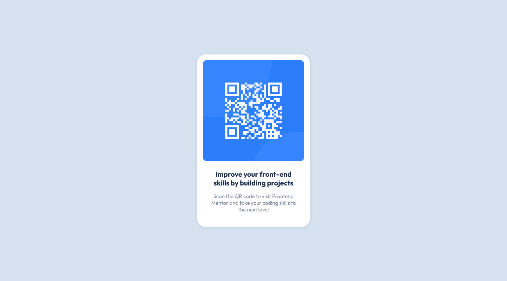

# Frontend Mentor - QR code component solution

This is a solution to the [QR code component challenge on Frontend Mentor](https://www.frontendmentor.io/challenges/qr-code-component-iux_sIO_H).

## Overview

These are aspects that I know I could improve:

- The text within the component doesn't align properly (the lighter text is meant to take up a lower width, but I allowed it to take a similar width as the darker text). I could fix this, but it would require adding hacky CSS, so I decided not to go that route.
- The box shadow is probably not accurate, though the source image was low enough quality that it would have been to much of a pain to fix.
- The padding in the image was measured to be 31px, but I kept it to be 32px (or 2rem). Other measurements had the same issue, but I didn't really care to have them be weird numbers.

### Screenshots

#### Mobile

#### Desktop

### Links

- [Solution URL](https://github.com/Daniel-Livingston/fm-qr-code-component)
- [Live Site URL](https://daniel-livingston.github.io/fm-qr-code-component/)

## Author

- GitHub - [Daniel Livingston](https://github.com/Daniel-Livingston)
